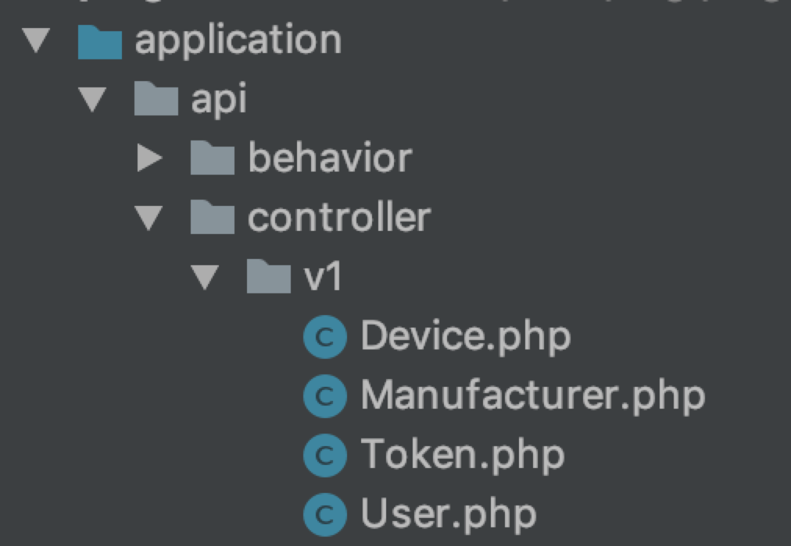

# 6.3.1.路由

---

TP5 路由的 URL 可采取默认的 PATH_INFO 模式来访问

```
http://serverName/index.php/module/controller/action/param/value/...
```

在这里对 PATH_INFO 模式作个解释，serverName 即访问的服务期 IP 或者域名。index.php 是 TP5 的入口文件地址，module 则是模型层，contorller 是控制器，action 是控制器携带的入口方法，Param 是方法携带的参数变量,Value 是参数具体的值。

在这里我们不用默认的 PATH_INFO 模式进行路由请求，而是采用以下的形式

```
Route::post('api/:version/getUserLogin','api/:version.user/getUserLogin');
```

Route 定义方法采用 Post，第一个参数为入口访问的 URL 形式，第二个参数为 TP5 规定的 URL 形式，即将入口访问的 URL 转变为符合 TP5 规定的形式进行访问，application 目录改成以下形式，访问的具体 API 为 http://xxxxxx/api/v1/getUserLogin ，该路由配置将把该访问定位到 api(Module)/v1.user(Contorller)/User (Action)下的 getUserLogin 方法

