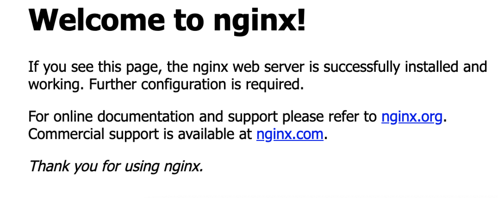

# 8.2.1.Nginx 环境

---

###默认情况 Centos7 中无 nginx 的源，最近发现 nginx 官网提供了 Centos 的源地址。因此可以如下执行命令添加源

```
sudo rpm-Uvh http://nginx.org/packages/centos/7/noarch/RPMS/nginx-release-centos-7-0.el7.ngx.noarch.rpm
```

###进入 CentOS 界面,通过 yum 安装 nginx

```
sudo yum install -y nginx
```

###启动 nginx 并设置开机自动运行

```
sudo systemctl start nginx.service
sudo systemctl enable nginx.service
```

###查看 nginx 版本

```
nginx -v
显示内容: nginx version: nginx/1.14.2
```

###启动 nginx

```
systemctl start nginx
```

###输入阿里云公网 IP 地址, 检验 nginx 环境搭建成功



###note:<br>
###nginx 安装文件路径: /etc/nginx
