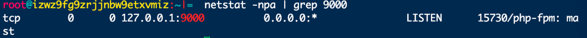

# 8.2.3.PHP 环境

---

###安装 php,默认安装为 php5.4

```
yum install php
```

###安装 php-fpm 服务

```
yum install php-fpm
```

###启动 php-fpm, php-fpm 的配置文件地址 /etc/php-fpm.d/www.conf

```
php-fpm -y /etc/php-fpm.d/www.conf
```

### 查看 9000 端口 php-fpm 服务是否启动，php-fpm 默认在 127.0.0.1:9000 端口

```
netstat -npa | grep 9000
```


###php-fpm 开机自启动

```
systemctl enable php-fpm.service
```

### 杀掉所有 php-fpm 进程

```
ps -ef|grep php-fpm|awk -F ' ' '{print $2}'|xargs kill -9
```

### 更新 php 版本,tp5 高版本框架不知道低版本 php

```
yum list |grep php
```

### 完全删除 php 库

```
#删除 php
yum remove php
#查看 php 依赖
yum list |grep php
#按照顺序删除依赖
# rpm -e php-cli(具体名字按照查看的来)
# rpm -e php-common(具体名字按照查看的来)
```

##Centos7 更新 php5.4->php7.1

###安装 epel-release

```
rpm -ivh http://dl.fedoraproject.org/pub/epel/7/x86_64/e/epel-release-7-5.noarch.rpm
```

###安装 PHP7 的 rpm 源(centos7.x)

```
rpm -Uvh https://mirror.webtatic.com/yum/el7/webtatic-release.rpm
```

###安装 PHP7 和依赖

```
yum install php71w
yum install php71w-fpm
yum install php71w-cli
yum install php71w-pdo.x86_64(访问数据库定义的轻量接口)
yum install php71w-mysql( MySql 数据库驱动)
```
