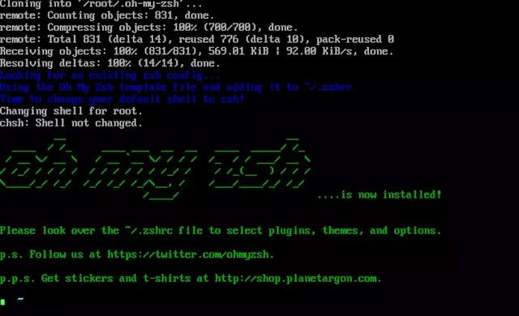

# 8.2.5.zsh 环境

---

### 安装 zsh

```
yum install zsh -y
```

### 安装 oh-my-zsh

```
sh -c "$(curl -fsSL https://raw.githubusercontent.com/robbyrussell/oh-my-zsh/master/tools/install.sh)"
```



### 将默认的 bash 切换成 zsh

```
chsh -s /bin/zsh
```

### 重启 CentOS

```
reboot
```

### 查看是否将 Shell 切换成 zsh

```
echo $SHELL
```

### 修改 zsh 的样式主题，配置文件在 ～/.zshrc

```
vim ~/.zshrc
```

### 修改 zsh 样式主题,添加常用插件

```
ZSH_THEME=pygmalion
#添加以下代码（添加常用插件）
plugins=(git colored-man colorize github jira vagrant virtualenv pip python brew osx zsh-syntax-highlighting)
```

### 重启 Centos 查看效果

```
reboot
```
