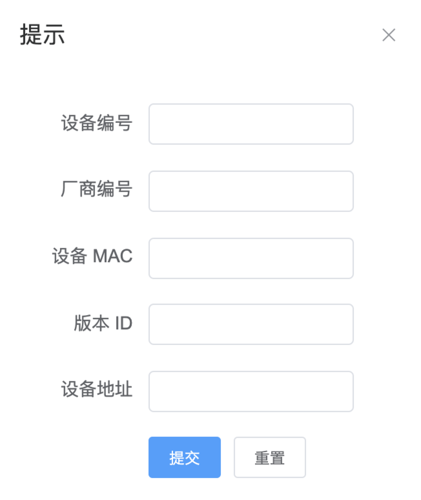

# 4.2.2.设备模块

---

设备模块包含设备注册以及设备状态两部分。设备注册填写的信息如下：厂商编号、设备编号、设备的 MAC 地址、设备的版本 ID、设备地址。厂商编号（已注册的厂商编号），设备编号（唯一值），设备 MAC 地址是网卡物理地址，版本 ID 为设备的固件版本 ID，设备地址为设备运行的地址信息。每台注册的设备对应各自的厂商，并且设备编号对应唯一的设备。

成功注册后，会在设备注册列表显示你注册的设备信息，并有设备信息的创建时间，设备模块允许更新设备注册信息，但不允许更新设备 ID，设备 ID 是唯一特性（注册设备的时候已确定），可更改厂商编号和设备地址，版本 ID，设备 MAC。允许更改厂商编号在这里作出解释，注册了的设备可能会被厂商转交给其它厂商使用，减少被转交厂商的系统操作流程。设备模块还允许移除设备注册信息。同时设备注册列表具有查询功能，能通过设备 ID 或厂商 ID 进行设备注册列表的查询，两种查询方式都为模糊查询。同时在表头有排序功能：厂商编号排序、设备编号、设备版本编号、创建时间、更新时间

当设备注册完成后，同步将设备信息更新到设备状态栏里。设备的默认状态为离线状态。在设备状态栏可以进行设备的开启、关闭操作。由于没有实际设备，这里用数据状态进行模拟。当点击开启设备时，设备的开始时间列表会记录开启时间，同时设备状态变为在线。当点击结束时间时设备的结束时间列表会记录结束时间。同时设备状态变为离线。
