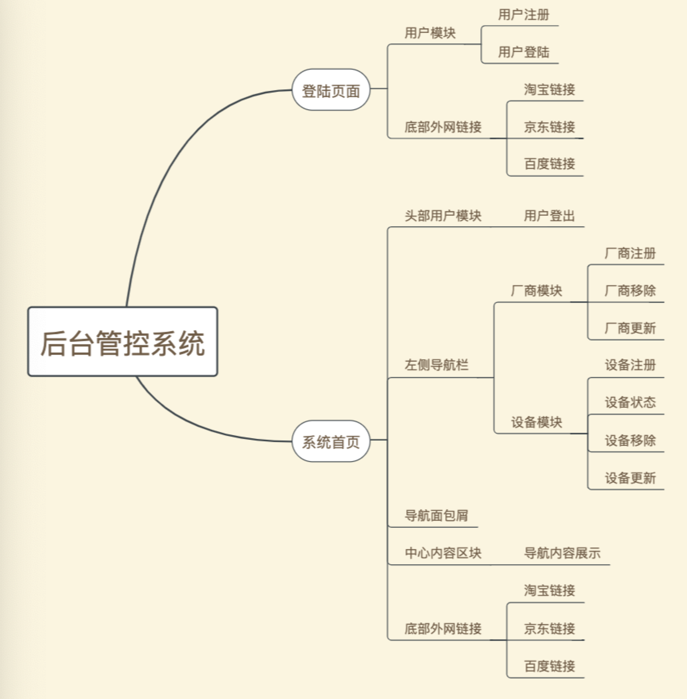

# 4.前端界面功能模块

---

后台管控系统页面只存在两个页面，一个是登陆页面，另一个是管控系统首页。管控系统设计理念是使得厂商能实时监控设备，在这里由于没有设备，则采用模拟数据进行设备在线状态的模拟。 
后台管控系统功能模块为三类： 
I.用户模块 
II.厂商模块 
III.设备模块 
后台管控界面模块为： 
I.头部共同组件 
II.底部共同组件 
III.内容区块（登录界面内容、导航栏、面包屑、导航界面展示等） 
IV.弹出框 
