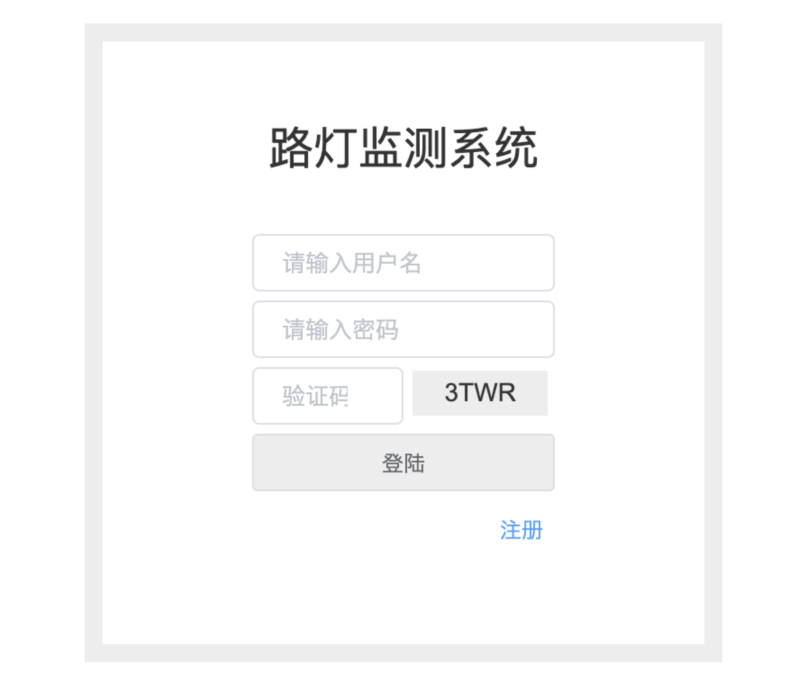

# 4.1.登陆页面

---

登陆界面划分为 3 个区域：头部区域、主体内容区域、底部区域，登陆页面是用户首次登上网址进入的页面。主体内容区域包含用户的登陆、注册。头部区域包含一个头像和欢迎的文本，底部区域包含外网链接和版权说明。

1. 头部区域 
   头部区域包含登录头像以及欢迎的文本文字
   
2. 内容区域 
   内容区域包含了用户的的登录注册面板
   

3. 底部区域 
   底部区域是版权说明以及外部链接（友链）
   
