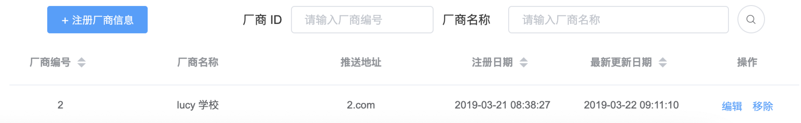

# 4.2.1.厂商模块

---

厂商模块包含厂商注册，该系统需厂商注册信息才可注册该厂商对应的设备。需填写厂商编号、厂商名称、推送地址。需注意的是，厂商编号（唯一值），一家厂商对应一个编号，厂商推送地址是预留给该厂商管理数据使用，当厂商有需求要将数据转发给他们使用时，则通过该推送地址推送数据。

成功注册后，会在厂商列表显示你注册的厂商信息，并有厂商信息的创建时间。厂商模块允许更新厂商信息，但不允许更新厂商 ID，厂商 ID 是唯一特性（注册厂商的时候已确定），可更改厂商名称和推送地址。厂商模块还允许移除厂商信息。同时厂商模块具有查询功能，能通过厂商 ID 或厂商名称进行厂商列表的查询，两种查询方式都为模糊查询。同时在表头有排序功能：厂商编号排序、注册日期排序、更新日期排序

